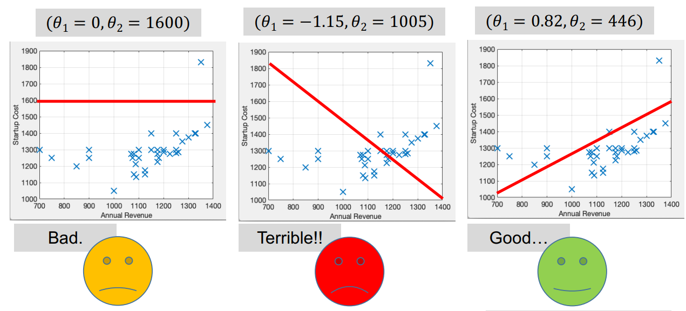
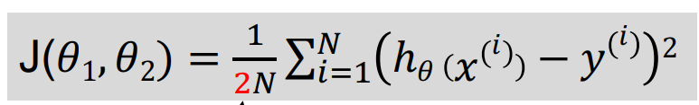
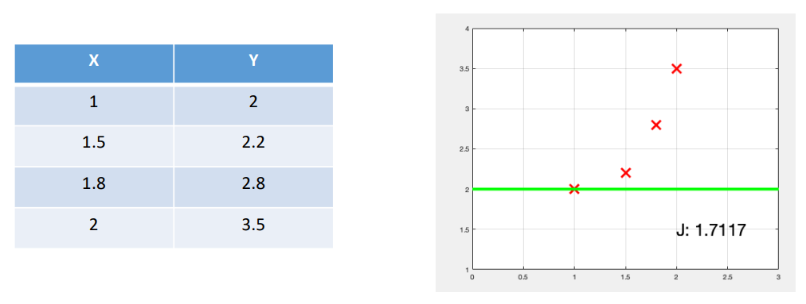
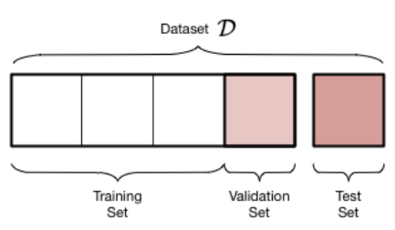

# Parte 1: Machine Learning

A tarefa principal do 'machine learning' é encontrar o melhor **modelo** (descrição de padrões) possível que expresse de
maneira ótima a relação entre as **variáveis independentes** (i.e. número de estudante) e as **variáveis dependentes**
(i.e. ano de entrada na universidade).

A nossa _hipotese_ no exemplo seria:
h(x) = θ0 + θ1 * x

Sendo que θ1 é o parâmetro do modelo, e x é a variável independente.

*Fig.1: Comparações entre modelos*

## Função de custo

A função de custo recebe os parâmetros do modelo e determinar o quão bem o modelo se ajusta aos dados. É ela que
distingue os bons modelos dos maus.

Ela é definida como:

*Fig.2: Função de custo, com o θ0 e o θ1 como os parâmetros do modelo*

## Machine Learning: Otimização

Nós obtemos os melhores valores possiveis minimizando a função de custo. Para isso, temos de calcular as derivadas
parciais da mesma, determinar os seus zeros e através da descida do gradiente, mover-se conforme a direção do gradiente
e o seu learning rate (taxa de aprendizagem/tamanho do passo feito).

### Exercicio da descida do gradiente

Considere este pequeno dataset. Use a descida do gradiente para encontrar os melhores valores para θ0 e θ1.

- Comece com θ0 = 0 e θ1 = 2
- Use uma taxa de aprendizagem de 0,1

*Fig.3: Dataset para o exercício*

#### Solução

Ainda meto fotos aqui...

### Problemas na classificação (Falsos positivos e falsos negativos)

Às vezes, o modelo não consegue prever corretamente os dados. Isto pode ser devido a um erro de classificação, ou
**falsos positivos** e **falsos negativos**.

- Falsos positivos: quando o modelo classifica um exemplo como positivo, no entanto, é negativo.

- Falsos negativos: quando o modelo classifica um exemplo como negativo, no entanto, é positivo.

#### Exemplo

Suponde que tamos interassados em prever as notas de uma turma. Tipicamente, os alunos que tiram notas boas no
seu primeiro trabalho de casa, tendem a tirar notas boas no resto do ano. No entanto, há sempre exceções. O modelo pode
prever que um aluno que tirou uma nota baixa no seu primeiro trabalho de casa, vai tirar uma nota baixa no resto do ano.
No entanto, este aluno pode ter tido um dia mau, e tirar uma nota alta no resto do ano (falso negativo).

Para evitar estes erros, temos de ajustar o nosso modelo de modo que esses casos expecificos tenham alguma
probabilidade de acontecer, através da função *Sigmoid*.

Como dito anteriormente, a função de custo vai medir o quão bem o modelo se ajusta aos dados. Por exemplo, se a resposta
de um sistema é suposto devolve '1' e o nosso modelo devolve '1' então o custo será 0.

## Setup Experimental

Uma das regras de ouro do machine learning é que devemos sempre dividir o nosso dataset em três partes:

- **Training set**: Usado para treinar o modelo.
- **Validation set**: Dá-nos uma avaliação imparcial do desempenho do nosso modelo sendo também usado para ajustar os
  parâmetros do modelo.
- **Test set**: Dá-nos uma avaliação imparcial do desempenho do nosso modelo final.

*Fig.4: Divisão do dataset*

No entanto, o nosso modelo não se pode ajustar demasiado/pouco ao dataset de treino, pois isso pode levar a um:

- **Overfitting**: O modelo ajusta-se demasiado ao dataset de treino, e não consegue generalizar bem para outros
  datasets.
- **Underfitting**: O modelo não consegue ajustar-se bem ao dataset de treino, e não consegue generalizar bem para
  outros datasets.

Para avaliar o quão bem está o nosso modelo tem:

- Accuracy(exactidão): número de exemplos corretamente classificados ((TP + TN) / (TP + TN + FP + FN)).
- Precision(precisão): o quão proximo o modelo está de classificar um exemplo como positivo (TP/(TP+FP)).
- Recall(sensibilidade): proporção de exemplos de output que foram detetados (TP/(TP+FN)).

# Supervised learning vs Unsupervised learning

**Supervised learning** é quando o conjunto de dados de treino inclui rótulos com as respostas corretas para cada
exemplo no conjunto. O objetivo é usar os exemplos rotulados para prever as respostas para novos exemplos.

**Unsupervised learning** é quando o conjunto de dados de treino não inclui rótulos. O objetivo é descobrir padrões nos
dados.

# Deep Learning

Ao contrário do machine learning, o deep learning usa redes neurais profundas para resolver problemas, isto é, redes
neurais com muitas camadas.

## Redes Neurais Convolucionais (CNN)

As redes neurais convolucionais são redes neurais profundas usadas para analisar imagens. Ao contrário das redes
tradicionais (Feed-Foward), os neurónios de uma CNN estão organizados em três dimensões.