# Parte 1: Otimização de pesquisa no espaço

A finalidade de um algoritmo de otimização de pesquisa é encontrar a melhor configuração para o θ que maximize/minimize
a nossa função objetivo, estado com o melhor f(θ), da maneira mais eficaz possível.

Para esta pesquisa local otima, existem 2 familias de métodos:

- Métodos de construção: começam do zero e vão a construir uma solução iterativamente.
- Métodos de reparação: começam num ponto aleatório (com bases periciais) e vão a ajustar os parametros e iterativamente
  melhorá-los.

Nota: Ultimamente, em ambos os casos, estes métodos usam apenas um único estado (estado atual), para antigir uma solução
imperfeita para um problema de pesquisa.

Alguns exemplos de algoritmos de pesquisa local:

- Hill Climbing: Como o nome diz, o objetivo é chegar sempre ao ponto mais alto possível, porém como ele analisa apenas
  os seus vizinhos diretos, não é garantido que ele chegue á solução ótima global.
- Tabu Search: É uma extensão do Hill Climbing, onde ele adiciona uma lista de estados que não podem ser visitados, para
  evitar ciclos.
- Simulated Annealing: É um método de busca local que usa uma função de probabilidade para decidir se o estado atual
  deve ser substituido pelo estado vizinho, ou se deve permanecer no estado atual.

## Conceito de Otimização

Entre os trés principais conceitos em inteligência artificial, temos:

- Algebra Linear.
- Estatísticas.
- Otimização.

Otimização refere-se encontrar o melhor resultado para a nossa função objetivo f(θ), por algoritmos que pesquisem no
espaço de estados que considera viáveis usando restrições, evitando assim avaliar estados que não são viáveis.

Por exemplo, neste caso, podemos determinar que a função A é melhor que a função B, pois a sua previsão distancia-se
menos do resultado espero que a outra solução, veja:

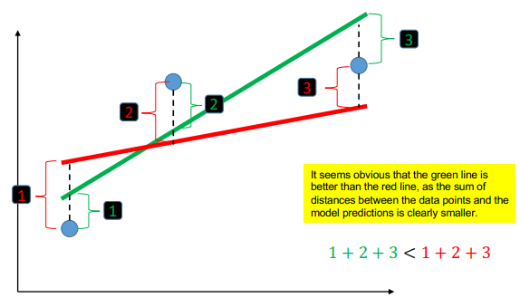

*Fig.1: Comparação entre duas funções de previsão.*

Também devemos considerar a complexidade de um problema (a sua convexidade), pois se o problema não for convexo, podem
existir vários mínimos locais, e não apenas um mínimo global, veja:

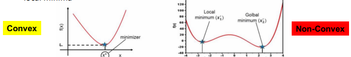

*Fig.2: Problema convexo vs não convexo*

### Método Closed Form (Forma Fechada)

Para minimizar uma função objetivo, temos uma das seguintes opções:

- Usando uma solução fechada (closed form).
- Iterativamente usando o método do gradiente descendente.

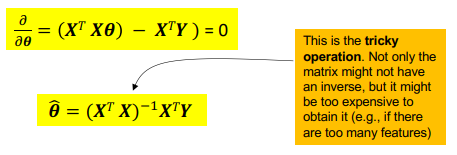

*Fig.3: Minimização pela forma fechada*

### Método do Gradiente Descendente

Na descida do gradiente (direção do gradiente), o objetivo é encontrar o mínimo de uma função, iterativamente.

Para isso, temos de calcular a derivada da mesma, determinar os seus zeros e mover-se conforme a direção do
gradiente e o seu learning rate (taxa de aprendizagem/tamanho do passo feito).

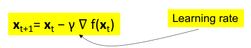

*Fig.4: Minimização pela descida do gradiente*

A taxa de aprendizagem é um hiperparâmetro que controla o tamanho do passo feito, e deve ser ajustado para cada
problema, pois:

- Se for muito pequeno, o algoritmo demorará muito tempo a convergir.
- Se for muito grande, o algoritmo pode não convergir.

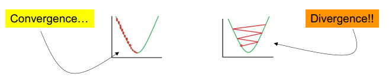

*Fig.5: Implicações da taxa de aprendizagem*

### Programação Linear

Neste método de otimização, podemos resolver de duas formas:

- Método gráfico: funciona bem quando temos poucos parâmetros (|θ| < 3). Este método é bastante visual, basta desenhar o
  espaço de estados e encontrar o ponto de interseção entre as retas (restrições).

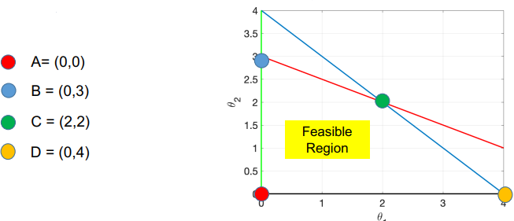

*Fig.6: Método gráfico*

- Método de simplex: funciona bem quando temos muitos parâmetros (|θ| > 3). Este método é mais matemático, baseado
  numa tabela de valores, onde cada linha representa uma restrição, e cada coluna representa um parâmetro. Como o
  seguinte exemplo:

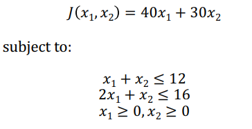

*Fig.7: Declaração da função objetivo e das restrições*

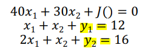

*Fig.9: Conjunto de equações igualada a zero incluindo a variável slack*

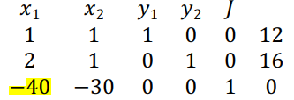

*Fig.10: Matriz de coeficientes*

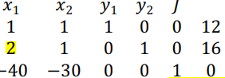

*Fig.11: Condensação da matriz de coeficientes 1*

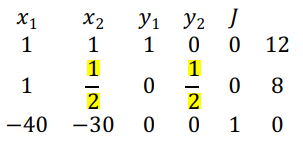

*Fig.12: Condensação da matriz de coeficientes 2*

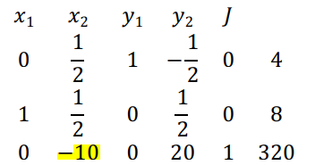

*Fig.13: Condensação da matriz de coeficientes 3*

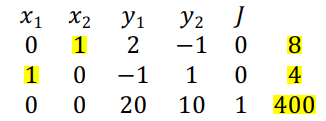

*Fig.14: Condensação da matriz de coeficientes 4*

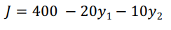

*Fig.15: Equação final tendo apenas os paramêtros como variáveis*

### Algoritmos de Genética

Neste método de otimização, temos uma população de indivíduos, e cada indivíduo tem um conjunto de genes (paramêtros). O
objetivo é encontrar a melhor solução para o problema, e para isso, temos de:

- Avaliar a qualidade de cada indivíduo.
- Selecionar os melhores indivíduos.
- Reproduzir os indivíduos selecionados.
- Mutar os indivíduos.
- Repetir o processo até que a solução seja encontrada.

Alguns conceitos a saber:

- População: Conjunto de indivíduos.
- Individuos: configuração de parametros que representa um estado.
- Seleção: escolher os melhores indivíduos para reprodução.

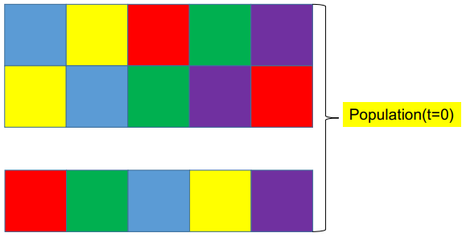

*Fig.15: Representação de uma população*

- Cruzamento: combinar os genes de dois indivíduos para gerar um novo indivíduo.

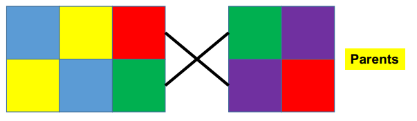

*Fig.16: Representação de um cruzamento*

- Mutação: alterar aleatoriamente um gene de um indivíduo.

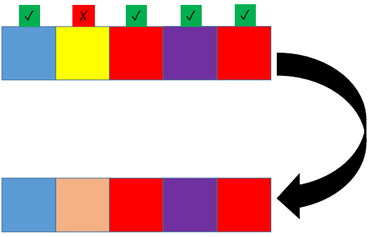

*Fig.17: Representação de uma mutação*

Algoritmo de genética em python:
```python
# Genetics Algorithm

# Variable that represents the initial population
population = [[1, 0, 1, 1, 1, 1], [1, 0, 0, 0, 1, 1],
              [0, 1, 1, 0, 1, 0], [1, 0, 0, 0, 0, 1],
              [1, 0, 1, 0, 1, 0], [0, 1, 0, 1, 0, 1]]

# Variable that represents the pairs that will be crossed
pairs = [[0, 3], [1, 5], [0, 1], [4, 3], [0, 2], [2, 4]]

# Variable that represents the position were the cut will be made
cut = [2, 1, 3, 2, 4, 2]

# Variable that represents what elements will be mutated
mutation = [[1], [0], [1, 2], [4, 5], [3], [2]]


# Function that makes the genetic algorithm
def genetic_algorithm():
    # Variable that represents the new population
    new_population = []

    # For each pair
    for i in range(len(pairs)):
        # Variable that represents the first parent
        parent1 = population[pairs[i][0]]

        # Variable that represents the second parent
        parent2 = population[pairs[i][1]]

        # Child will be the first part of the first parent and the second part of the second parent
        child = []
        child.extend(parent1[:cut[i] + 1])
        child.extend(parent2[cut[i] + 1:])
        
        # Each element that will be mutated, change the value
        for j in mutation[i]:
            child[j] = 1 - child[j]

        # Append the childs to the new population
        new_population.append(child)
```

#### Exercício

Considere a seguinte população (t=0):

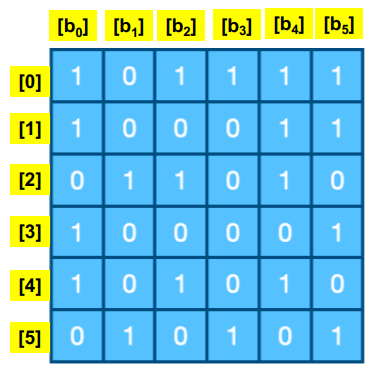

*Fig.18: População inicial*

Usando a seguinte seleção determine a nova população (t=1) e determina a função objetivo de ambas e determina qual tem o
valor maior:

- Os pares são:
    - (0,3), o cruzamento será na posição 2 e o elemento (1) será mutado;
    - (1,5), o cruzamento será na posição 1 e o elemento (0) será mutado;
    - (0,1), o cruzamento será na posição 3 e o elemento (1,2) será mutado;
    - (4,3), o cruzamento será na posição 2 e o elemento (4,5) será mutado;
    - (0,2), o cruzamento será na posição 4 e o elemento (3) será mutado;
    - (2,4), o cruzamento será na posição 2 e o elemento (2) será mutado;
- A função objetivo é o somatório de todos os parâmetros.

Resolução parcial:

1. O individio 1 corresponde a: [1,0,0,0,1,1]
2. O individio 5 corresponde a: [0,1,0,1,0,1]
3. O cruzamento entre eles, na posição 1, dará origem a 2 novos individuos: [1,0,0,1,0,1]
4. Porém, com a mutação na posição 0, os novos individuos serão: [0,0,0,1,0,1]
