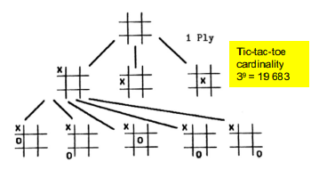
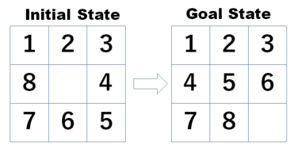
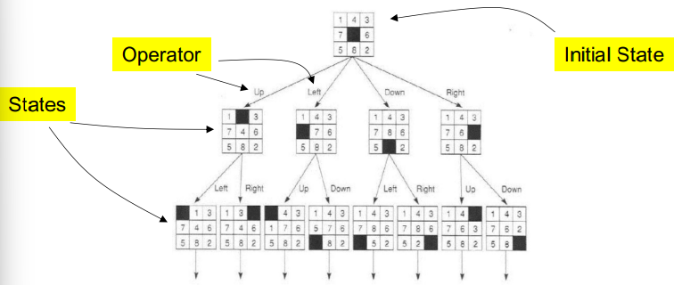
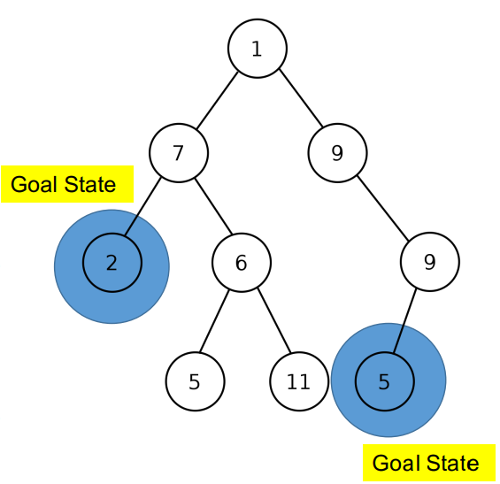
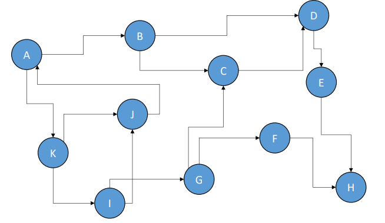
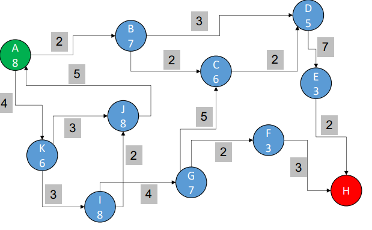
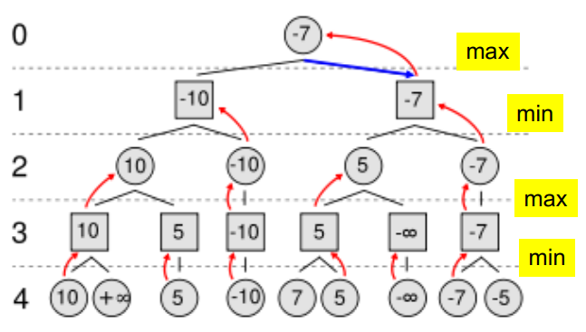
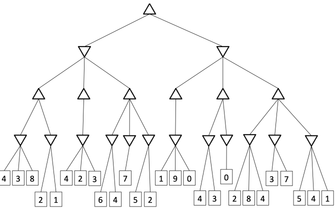
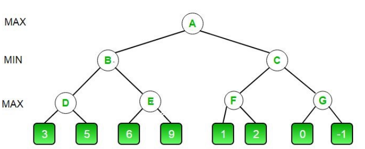
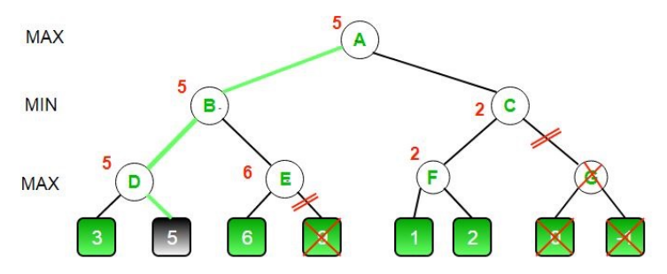

# Parte 1: Pesquisa em Espaço de Estados

## Tipos de agentes de I.A.

Os dois agentes IA mais gerais são:

- Artificial Narrow Intelligence (ANI): São agentes conseguem executar uma só tarefa
  de modo inteligente e melhor que um ser humano, porém são inuteís em outras tarefas (Weak AI).


- Artificial General Intelligence (AGI): São agentes que conseguem executar e adaptar-se multiplas
  tarefas melhor que um ser humano (Strong AI).

## Representação de estados

### Definição de estado

Um **estado** é uma representa toda a informação relativa á **posição atual do agente no ambiente** (espaço de estados)
numa estrutura de dados. Alguns estados podem ser denominados **solução** ou **objetivo**, pois representam uma situação
que o agente deseja alcançar.



*Fig.1 — Exemplo de um espaço de estados*

### Representação de estados (Exercicios)

Neste exemplo temos um ‘_puzzle_’ de 8 peças representado numa matriz 3x3 (9 quadrados). Um dos quadrados está vazio e
as outras 8 peças estão dispostas aleatoriamente. O objetivo é mover as peças para que elas fiquem na ordem correta,
como mostrado na figura 2.



*Fig.2 — Exemplo de estado inicial/Estado Objetivo*

1. Define um modo apropriado de representar um estado do ‘_puzzle_’ no Python.
2. Cria uma função em python que recebe um estado e retorna os seus sucessores.
3. Cria uma função em python que recebe um estado e uma profundidade e retorna uma árvore de estados.
4. Cria uma função em python que recebe um estado inicial e percorre a sua árvore de estados e retorna a profundidade da
   melhor solução usando BFS.

```python
estado = [1, 2, 3, 4, 5, 6, 7, 8, 0]
```

```python
def sucessores(estado):
    sucessores = []
    # Encontrar o índice do espaço vazio
    pos_zero = estado.index(0)
    # Converter a posição para 2D
    pos_zero_2d = (pos_zero // 3, pos_zero % 3)
    
    if pos_zero_2d[0] > 0:
        # Mover para cima
        novo_estado = estado.copy()
        novo_estado[pos_zero] = novo_estado[pos_zero - 3]
        novo_estado[pos_zero - 3] = 0
        sucessores.append(novo_estado)
    if pos_zero_2d[0] < 2:
        # Mover para baixo
        novo_estado = estado.copy()
        novo_estado[pos_zero] = novo_estado[pos_zero + 3]
        novo_estado[pos_zero + 3] = 0
        sucessores.append(novo_estado)
    if pos_zero_2d[1] > 0:
        # Mover para esquerda
        novo_estado = estado.copy()
        novo_estado[pos_zero] = novo_estado[pos_zero - 1]
        novo_estado[pos_zero - 1] = 0
        sucessores.append(novo_estado)
    if pos_zero_2d[1] < 2:
        # Mover para direita
        novo_estado = estado.copy()
        novo_estado[pos_zero] = novo_estado[pos_zero + 1]
        novo_estado[pos_zero + 1] = 0
        sucessores.append(novo_estado)
    return sucessores
```

```python
# Representação da árvore de estados: arvore = [estado, profundidade, [filhos]]
def arvore_estados(estado, profundidade):
    arvore = [estado, profundidade, []]
    if profundidade > 0:
        for filho in sucessores(estado):
            arvore[2].append(arvore_estados(filho, profundidade - 1))
    return arvore
```

```python
def bfs(estado_inicial):
    # Representação da fila: fila = [[estado, profundidade]]
    fila = [[estado_inicial, 0]]
    while fila:
        estado, profundidade = fila.pop(0)
        if estado == estado_objetivo:
            return profundidade
        for filho in sucessores(estado):
            fila.append([filho, profundidade + 1])
    return -1
```

# Parte 2: Pesquisa em Espaço de Estados

## Problemas de Pesquisa em Espaço de Estados

São baseados em duas partes:

- Num **estado** que contém a informação necessária para prever qual efeito terá uma ação para determinar um certo
  objetivo.
- Num conjunto de **operadores** que definem o quão válido é a passagem de um estado para outro.



### Exemplo: O problema dos jarros de água

Temos 2 jarros de capacidade 4 e 3 litros respetivamente. O objetivo é encher o jarro de 4 litros com água com
exatamente 2 litros. O estado inicial é ambos os jarros vazios.

Passo-a-passo:

- Definir a estrutura de dados para representar um estado

```
estado = (X, Y) onde X e Y são as quantidades de água no jarro de 4 e 3 litros respetivamente.
```

- Definir os operadores

```
- encher_jarro_4: (X, Y) -> (4, Y)
- encher_jarro_3: (X, Y) -> (X, 3)
- esvaziar_jarro_4: (X, Y) -> (0, Y)
- esvaziar_jarro_3: (X, Y) -> (X, 0)
- transferir_jarro_4_para_3: (X, Y) -> (X + d, Y - d)
- transferir_jarro_3_para_4: (X, Y) -> (X - d, Y + d)
```


*Fig.2 Exemplo de uma possivel solução*

### Exercício

Escreve um programa que resolva o problema dos jarros de água (em Python).

```python
def encher_jarro_4(estado):
    return (4, estado[1])
def encher_jarro_3(estado):
    return (estado[0], 3)
def esvaziar_jarro_4(estado):
    return (0, estado[1])
def esvaziar_jarro_3(estado):
    return (estado[0], 0)
def transferir_jarro_4_para_3(estado):
    d = min(estado[0], 3 - estado[1])
    return (estado[0] - d, estado[1] + d)
def transferir_jarro_3_para_4(estado):
    d = min(estado[1], 4 - estado[0])
    return (estado[0] + d, estado[1] - d)
def sucessores(estado):
    return [encher_jarro_4(estado), encher_jarro_3(estado), esvaziar_jarro_4(estado), esvaziar_jarro_3(estado), transferir_jarro_4_para_3(estado), transferir_jarro_3_para_4(estado)]
def bfs(estado_inicial, objetivo):
    visitados = set()
    fila = [estado_inicial]
    while fila:
        estado = fila.pop(0)
        if estado == objetivo:
            return True
        visitados.add(estado)
        for s in sucessores(estado):
            if s not in visitados:
                fila.append(s)
    return False
print(bfs((0, 0), (2, 0)))
```

## Solução Ótima em problemas de Pesquisa em Espaço de Estados

No exemplo anterior não foi considerado o **custo** das operações feitas para atingir o objetivo. Por vezes podemos
atingir uma solução de maneiras diferentes e até mesmo com um **número menor de operações**.



Existem diversas estrátegias de pesquisa num espaço de estados, que estão normalmente divididas em 2 famílias:

- **Não informadas**: não utilizam nenhuma informação adicional sobre o problema.


- **Informadas**: utilizam informação adicional sobre o problema.

## Pesquisa Não Informada

Dentro desta categoria existem duas estratégias principais:

- **Breadth-First Search (BFS)**: explora os nós da árvore de estados em largura (último nó a entrar é o primeiro a
  sair).


- **Depth-First Search (DFS)**: explora os nós da árvore de estados em profundidade (primeiro nó a entrar é o último a
  sair).

### Algoritmo

Aqui contém um exemplo de pseudocódigo para a BFS/DFS:

```python
1. Declara o estado atual
2. Declara a lista de estados a explorar
3. Declara a lista de estados explorados
4. Adiciona o estado atual à lista de estados a explorar
5. Enquanto a lista de estados a explorar não estiver vazia
  1. Extrai (para 'atual') e retira o primeiro estado da lista de estados a explorar
  2. Se o estado 'atual' for o objetivo, retorna-o
  3. Encontra os sucessores do estado atual
  4. Para cada sucessor, verifica se já foi explorado ou se já está na lista dos estados por explorar
    1. Adiciona o estado à lista de estados a explorar (no início no caso da DFS e no fim no caso da BFS)
  5. Adiciona o estado atual à lista de estados explorados
6. Se não encontrar nenhum estado objetivo, retorna Nulo
```

### Exercício

Através do seguinte grafo e do algoritmo de BFS, escreve o caminho percorrido para chegar ao objetivo.


Resolução:

```
amanhã meto prometo
```

## Pesquisa Informada

Um exemplo é **pesquisa A<sup>*</sup>** que utiliza uma função que representa o **custo estimado** de atingir o objetivo
a partir de um determinado estado 'g(x)' e uma função que avalia o quão perto estamos do objetivo 'h(x)'.
Esta função é chamada **função de avaliação** sendo definida como:

```
f(x) = g(x) + h(x), onde g(x) é o custo do caminho e h(x) é o custo do estado
```

### Algoritmo

Aqui contém um pseudocódigo para a pesquisa A<sup>*</sup>:

```python
1. Declara o estado atual
2. Declara a lista de estados a explorar
3. Declara a lista de estados explorados
4. Adiciona o estado atual à lista de estados a explorar
5. Enquanto a lista de estados a explorar não estiver vazia
  1. Extrai (para 'atual') e retira o primeiro estado da lista de estados a explorar
  2. Se o estado 'atual' for o objetivo retorna-o
  3. Encontra os sucessores do estado atual
  4. Para cada sucessor, ver se já foi explorado ou se já se encontra na lista dos estados por explorar
    1. Se não estiverem na lista de estados a explorar nem na lista de estados explorados, adiciona o estado à lista de estados a explorar por ordem crescente de f(x)
  5. Adiciona o estado atual à lista de estados explorados
6. Se não encontrar nenhum estado objetivo, retorna Nulo
```

## Exercício

Através do seguinte gráfico e do algoritmo A<sup>*</sup> encontra o caminho mais curto entre o nó A e o nó H.


#### Solução

Explorados : [A]
Por explorar : [B, K]

-------------------------
como f(B) = 2 + 7 = 9 e f(B) < f(K),

Explorados : [A, B]

Por explorar: [D, C, K, I, J]

-------------------------
como f(D) = 2 + 3 + 2 = 7 e f(D) < f(C) < f(K) < f(I) < f(J),

Explorados : [A, B, D]

Por explorar: [C, K, I, J, E, G]

(Continuar por aqui)

Resposta : A -> B -> D -> E -> H

## Parte 3: Antagonistas

Estes são os **agentes que tentam impedir o agente principal** de atingir o seu objetivo. Nesta pesquisa (muito
utilizado em I.A. de jogos) o nosso agente terá de encontrar aquela que será a melhor solução para ele (máximização) e
simultaneamente tentar impedir que o adversário encontre a melhor solução para ele (minimização).

## Minimax

Este algoritmo é baseado na seguinte ideia:

- A **raiz** é o nó que representa o estado atual do jogo.
- Os dois jogadores são chamados **maximizador** e **minimizador**.
- O **maximizador** tenta obter o **valor máximo** possível.
- O **minimizador** tenta obter o **valor mínimo** possível.
- Assumimos que os dois jogadores jogam de forma **ótima**, logo é importante pensar sempre no pior cenário possível.

### Exemplo com 4 níveis



### Algoritmo

```python
1. Se a profundidade for 0 ou o nó for um nó terminal (folha), retorna o valor do nó
2. Caso seja o maximizador a jogar, maximiza o valor
   1. valor = -infinito
   2. Para cada filho do nó
     1. Máximo entre o valor e o valor do filho (agora a jogar é o minimizador)
3. Caso seja o minimizador a jogar, minimiza o valor
   1. valor = infinito
   2. Para cada filho do nó
     1. Mínimo entre o valor e o valor do filho (agora a jogar é o maximizador)
4. Retorna o valor
```

### Exercício

Considere a seguinte árvore, onde os triangulos para cima representam o jogador 1 e os triangulos para baixo representam
o jogador 2. O jogador 1 quer maximizar o valor e o jogador 2, quer minimizar o valor. Aplica o algoritmo minimax para
encontrar o valor da raiz.



## Alfa-Beta

Este é um método de corte que permite reduzir o número de nós a explorar no algoritmo minimax. Este método é baseado na
seguinte ideia:

- O **alfa** representa o **valor máximo** que o **maximizador** pode obter garantidamente (é inicializado com −∞).
- O **beta** representa o **valor mínimo** que o **minimizador** pode obter garantidamente (é inicializado com +∞).
- A ideia geral é cortar as ramificações que não precisam de ser exploradas, pois, já sabemos que não vão ser
  escolhidas.
- Em cada nó em que o alpha é maior ou igual ao beta, podemos cortar a árvore.

### Algoritmo

```python
1. Se a profundidade for 0 ou o nó for um nó terminal (folha), retorna o valor do nó
2. Caso seja o maximizador a jogar, maximiza o valor
   1. valor = -infinito
   2. Para cada filho do nó
     1. Máximo entre o valor e o valor do filho (agora a jogar é o minimizador)
     2. Alfa = Máximo entre o alfa e o valor
     3. Se o valor for maior ou igual ao beta, corta a árvore
3. Caso seja o minimizador a jogar, minimiza o valor
    1. valor = infinito
    2. Para cada filho do nó
      1. Mínimo entre o valor e o valor do filho (agora a jogar é o maximizador)
      2. Beta = Mínimo entre o beta e o valor
      3. Se o valor for menor ou igual ao alfa, corta a árvore
4. Retorna o valor
```

### Exercício

Considere a seguinte árvore e o algoritmo minimax com corte alfa-beta. Aplica o algoritmo minimax com corte alfa-beta
para encontrar o valor da raiz.



#### Solução

