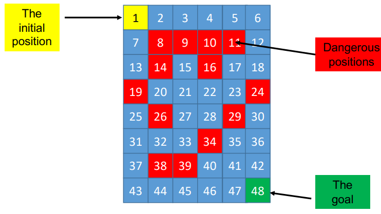

# Q-Learning exercício

Temos este pequeno labiritinto onde o nosso agente deve conseguir encontrar o melhor caminho para o objtivo, evitando
as posições vermelhas.



*Fig.1: Labirinto*

Resolução:

A nossa tabela Q irá ter 48 linhas e 4 colunas, representando os 48 estados possíveis e as 4 ações possíveis. E vamos
inicializá-la com zeros:

| Esquerda | Direita | Cima | Baixo |
|----------|---------|------|-------|
| 0        | 0       | 0    | 0     |
| 0        | 0       | 0    | 0     |
| 0        | 0       | 0    | 0     |
| 0        | 0       | 0    | 0     |
| 0        | 0       | 0    | 0     |
| 0        | 0       | 0    | 0     |
| 0        | 0       | 0    | 0     |
| 0        | 0       | 0    | 0     |
| 0        | 0       | 0    | 0     |
| 0        | 0       | 0    | 0     |
| 0        | 0       | 0    | 0     |
| 0        | 0       | 0    | 0     |
| 0        | 0       | 0    | 0     |
| 0        | 0       | 0    | 0     |
| 0        | 0       | 0    | 0     |
| 0        | 0       | 0    | 0     |
| 0        | 0       | 0    | 0     |
| 0        | 0       | 0    | 0     |
| 0        | 0       | 0    | 0     |
| 0        | 0       | 0    | 0     |
| 0        | 0       | 0    | 0     |
| 0        | 0       | 0    | 0     |
| 0        | 0       | 0    | 0     |
| 0        | 0       | 0    | 0     |
| 0        | 0       | 0    | 0     |
| 0        | 0       | 0    | 0     |
| 0        | 0       | 0    | 0     |
| 0        | 0       | 0    | 0     |
| 0        | 0       | 0    | 0     |
| 0        | 0       | 0    | 0     |
| 0        | 0       | 0    | 0     |
| 0        | 0       | 0    | 0     |
| 0        | 0       | 0    | 0     |
| 0        | 0       | 0    | 0     |
| 0        | 0       | 0    | 0     |
| 0        | 0       | 0    | 0     |
| 0        | 0       | 0    | 0     |
| 0        | 0       | 0    | 0     |
| 0        | 0       | 0    | 0     |
| 0        | 0       | 0    | 0     |
| 0        | 0       | 0    | 0     |
| 0        | 0       | 0    | 0     |
| 0        | 0       | 0    | 0     |
| 0        | 0       | 0    | 0     |
| 0        | 0       | 0    | 0     |
| 0        | 0       | 0    | 0     |
| 0        | 0       | 0    | 0     |
| 0        | 0       | 0    | 0     |

*Tabela 1: Tabela Q*

Vamos começar por criar a matriz de recompensas que será de tamanho 48x48, onde cada linha representa um estado e cada
coluna, uma ação, e o seguinte acontece:

- Caso a ação seja possível, a recompensa é 0;
- Caso a ação não seja possível, a recompensa é -1;
- Caso a ação seja possível e o estado seguinte, seja o estado objetivo, a recompensa é infinito;
- Caso a ação seja possível e o estado seguinte, seja um estado vermelho, a recompensa é -infinito;

A primeira linha seria algo assim:

[-1,0,-1,-1,-1,-1,0,-1,-1,...]

Começa o processo de aprendizagem:

- Seleciona um estado aleatório (i.e. estado 7):
    - Pode mover-se para a direita (estado 8);
    - Pode mover-se para baixo (estado 13);
- Avalia as transições possíveis:
    - A transição para o estado 13 tem custo -1;
    - A transição para o estado 8 tem custo -infinito;
- O componente future deste estado é o máximo dos custos dos estados seguintes, ou seja, -1;
- Depois vamos atualizar na tabela de Q o valor da ação que escolhemos, neste caso, a ação de ir para baixo:

```
Qnovo(1,7) = (1-LR) * Qvelho(1,7) + LR * (R(1,7) + Y * -1)
```

- LR: learning rate (taxa de aprendizagem);
- Y: future balance (componente futuro);
- R(1,7): recompensa da ação 1 no estado 7;


Agora é repetir o processo.