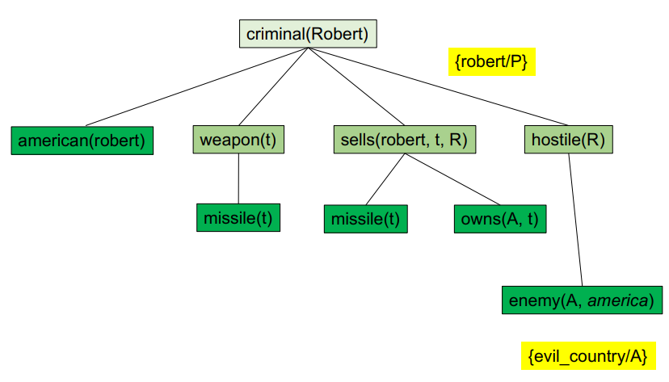

# Parte 1: Representação de conhecimento

Objetivo a longo prazo: Desenvolver um autómato que consiga comportar-se de modo inteligente:

- Capacidade de raciocínio;
- Capacidade de adaptação;
- Capacidade de comunicação;
- Capacidade de interação;

Um agente inteligente deve ser capaz de:

- Analisar o ambiente;
- Definir objetivos;
- Deduzir novo conhecimento;

## Base de conhecimento

No paradigma de agentes inteligentes, o conhecimento é representado de três formas:

- **Factos**: Eles são apresentados de início, compostos por **objetos** (ex: _tiago_), **propriedades** (ex: gay(
  _tiago_)) e **relações** (casal(_tiago_, _mangalhos_)).;
- **Regras**: São definidas a partir dos factos, compostas por **premissas** e **conclusões** (feminino(X) AND
  progenitor(X, Y) à mae(X, Y));
- **Deduções**: Existem duas formas de dedução:
    - ‘Forward’: usada para provar os factos. Começa com as premissas e vai a deduzir até chegar à conclusão;
    - ’Backward’: usada para provar as regras. Começa com a conclusão e vai a deduzir até chegar às premissas;

### Exercício 1

Considerando a seguinte base de conhecimento:

- american(P) AND weapon(Q) AND sells(P, Q, R) AND hostile(R) → criminal(P)
- owns(evil_country, t)
- missile(t)
- missile(P) AND owns(evil_country, P) → sells(robert, P, evil_country)
- missile(P) → weapon(P)
- enemy(P, america) → hostile(P)
- enemy(evil_country, america)
- american(robert).

1. Prove criminal(robert).

R:

- Sabemos que para ser um criminoso têm de acontecer três coisas: ser americano, ter uma arma e vender a arma a um
  país hostil.

- Como sabemos que o robert é americano, temos de saber se ele tem uma arma e vendeu-se a arma a um país
  hostil. Então sabemos, american(robert) → true, precisamos saber se sells(robert, t,evil_country) → true.

- Sabemos que o robert tem uma arma, pois tem um míssil. Sabemos que o robert vendeu a arma a um país hostil, pois
  o país é o evil_country. Então, missile(t) → weapon(t), owns(evil_country, t) → true, enemy(evil_country, america) →
  hostile(evil_country) → true.

- Então, american(robert) AND weapon(t) AND sells(robert, t, evil_country) AND hostile(evil_country) → criminal(
  robert) → true.

*Fig. 1: Exemplo de dedução inversa*

### Exercício 2

Considerando a seguinte base de conhecimento:

1. progenitor(jock, morgan);
2. progenitor(jock, alasdair);
3. progenitor(clark, ann)
4. progenitor(jock, hamish);
5. progenitor(mairi, morgan);
6. progenitor(albert, ann)
7. progenitor(mairi, alasdair);
8. progenitor(mairi, hamish);
9. progenitor(hamish, albert)
10. progenitor(fergus, jock);
11. progenitor(rhoda, jock);
12. progenitor(hamish,clark)
13. progenitor(fergus, flora);
14. progenitor(rhoda, flora)
15. masculino(fergus);
16. masculino(jock);
17. masculino(alasdair);
18. masculino(hamish)
19. feminino(rhoda);
20. feminino(mairi);
21. feminino(morgan);
22. feminino(flora)
23. masculino(albert);
24. masculino(dock);
25. feminino(ann);
26. feminino(clark)
27. progenitor(A,B) AND feminino(A) → mae(A,B)
28. progenitor(A,B) AND masculino(A) → pai(A,B)
29. progenitor(A,B) AND progenitor(B,C) AND masculino(A) → avô(A,C)
30. progenitor(A,B) AND progenitor(B,C) AND feminino(A) → avó(A,C)
31. pai(A,B) → antepassado(A, B)
32. pai(A,B) AND antepassado(B,C) → antepassado(A,C)

Pergunta 1: Definir regras das relações correspondentes:

- Tio(A,B), Obtém-se por: progenitor(A,B) AND progenitor(A,C) AND progenitor(C,D) AND (B != C) AND masculino(B) → Tio(
  B,D)
- Sobrinho(A,B), Obtém-se por: progenitor(A,B) AND progenitor(A,C) AND progenitor(C,D) AND (B != C) AND masculino(B) →
  Sobrinho(D,B) OU Tio(B,D) → Sobrinho(D,B)
- Primo(A,B), Obtém-se por: progenitor(A,B) AND progenitor(A,C) AND progenitor(C,D) AND progenitor(B,E) AND (B != C)
  AND (D != E) → Primo(E,D)
- Irmão(A,B), Obtém-se por: progenitor(A,B) AND progenitor(A,C) AND (B != C) AND masculino(B) → Irmão(B,C)
- Filho(A,B), Obtém-se por: progenitor(B,A) AND masculino(A) → Filho(A,B)

Pergunta 2: Usar dedução inversa para provar as seguintes afirmações:

- *Mairi* é antepassado de *Ann*?
- Quais os filhos de *Jock*?
- Quais os primos de *Flora*?

R: Façam FODA-SE!

